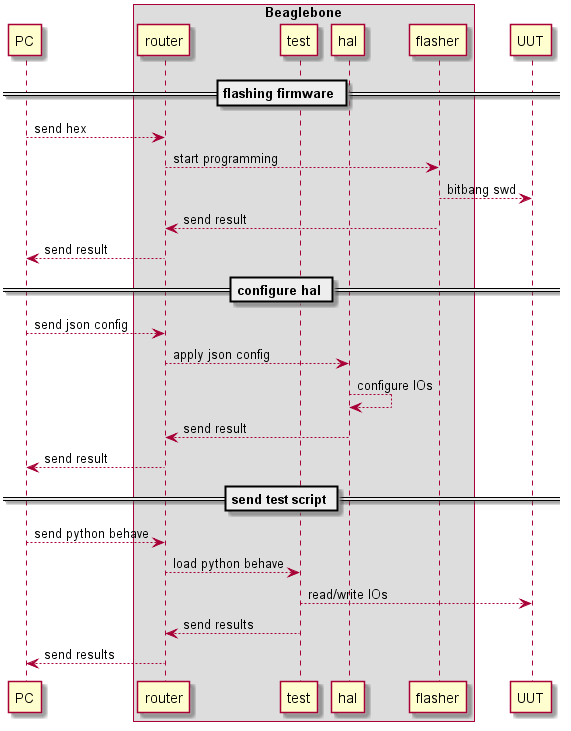

# BDD System Test
BDD driven framework using Beaglebone.

Beaglebone interface to the UUT via an IO cape. The aim is to use python behave, OpenOCD bitbang, ZeroMQ and Adafruit BBIO library to develop the framework. PC can be replaced by Jenkins server. Result shall be in XML format that can be easily parsed by Jenkins. The test can be develop without the Beaglebone using PyTest and mock.

Originally coined this concept in my previous company. Sequence diagram generated using PlantUML.

### Reference
 

- [Adafruit BBIO](https://github.com/adafruit/adafruit-beaglebone-io-python)
- [Use of BeagleBone GPIO for SWD programming](https://www.disk91.com/2014/technology/hardware/use-of-beaglebone-gpio-for-swd-programming)
- [Python Behave](http://pythonhosted.org/behave/)
- [ZeroMQ](http://zeromq.org/)
- [PyTest](https://docs.pytest.org/en/latest/)
- [Mock](https://pypi.python.org/pypi/mock)